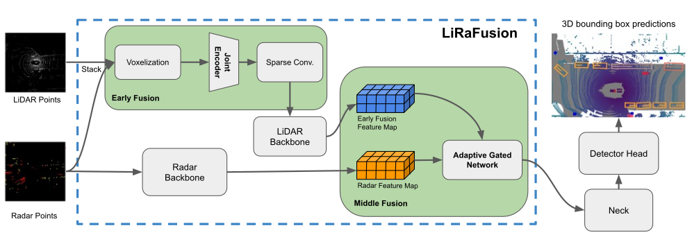

# LiRaFusion - Deep Adaptive LiDAR-Radar Fusion for 3D Object Detection
### [Paper](https://arxiv.org/abs/2402.11735)


## News

- **(2024/5)** We have released the codebase of LiRaFusion! Please check the readme document for the usage.
- **(2024/1)** LiRaFusion is accepted to [ICRA 2024](https://2024.ieee-icra.org/)! See you in Yokohama, Japan!


## Abstract

We propose LiRaFusion to tackle LiDAR-radar fusion for 3D object detection to fill the performance gap of existing LiDAR-radar detectors. To improve the feature extraction capabilities from these two modalities, we design an early fusion module for joint voxel feature encoding, and a middle fusion module to adaptively fuse feature maps via a gated network. We perform extensive evaluation on nuScenes to demonstrate that LiRaFusion leverages the complementary information of LiDAR and radar effectively and achieves notable improvement over existing methods. 
<!-- add svg figure media/Picture1.svg below-->



## Results
Our method achieves state-of-the-art LiDAR-radar detection performance on the nuScenes dataset. We show a table of a comparison of LiRaFusion (using TransHead) with other methods below. Please feel free to check more results in our paper.
<!-- convert the following table from tex to md -->
<!-- \begin{tabular}{c|c|c|ccccccccccc}
\hline
\multirow{2}{*}{Method} & \multirow{2}{*}{Sensor} & \multirow{2}{*}{NDS $\uparrow$} & \multicolumn{11}{c}{AP (Average Precision) $\uparrow$}                                                                                                                         \\
                        &                         &                                 & mean (mAP)     & Car           & Ped           & Bicycle       & Bus           & Barrier       & TC            & Truck         & Trailer       & Moto          & CV            \\ \hline
FUTR3D-LO               & LO                      & 65.74                           & 59.39          & 84.3          & 81.4          & 49.0          & 65.4          & \textbf{62.4} & 64.2          & 53.5          & \textbf{41.8} & 66.4          & 25.5          \\
FUTR3D-LR               & LR                      & 65.37                           & 58.08          & 83.8          & 81.2          & \textbf{49.8} & 65.4          & 60.4          & 60.6          & 51.0          & 41.0          & 65.1          & 22.6          \\
EZFusion-LR$^*$         & LR                      & 65.77                           & 59.24          & 84.6          & 81.7          & 47.3          & 69.1          & 62.0          & 65.7          & 52.2          & 39.7          & 66.9          & 23.3          \\
LiRaFusion (ours)         & LR                      & \textbf{66.69}                  & \textbf{60.11} & \textbf{85.6} & \textbf{82.2} & 46.9          & \textbf{69.6} & 61.2          & \textbf{66.0} & \textbf{54.0} & 40.7          & \textbf{68.1} & \textbf{26.7}
\end{tabular} -->

| Method       | Sensor | NDS $\uparrow$ | mAP $\uparrow$ | Car $\uparrow$ | Ped $\uparrow$ | Bicycle $\uparrow$ | Bus $\uparrow$ | Barrier $\uparrow$ | TC $\uparrow$ | Truck $\uparrow$ | Trailer $\uparrow$ | Moto $\uparrow$ | CV $\uparrow$ |
|--------------|--------|----------------|-----------------|----------------|----------------|-------------------|----------------|-------------------|---------------|------------------|-------------------|----------------|---------------|
| FUTR3D-LO    | LO     | 65.74          | 59.39           | 84.3           | 81.4           | 49.0              | 65.4           | 62.4              | 64.2          | 53.5             | 41.8              | 66.4           | 25.5          |
| FUTR3D-LR    | LR     | 65.37          | 58.08           | 83.8           | 81.2           | 49.8              | 65.4           | 60.4              | 60.6          | 51.0             | 41.0              | 65.1           | 22.6          |
| EZFusion-LR$^*$ | LR     | 65.77          | 59.24           | 84.6           | 81.7           | 47.3              | 69.1           | 62.0              | 65.7          | 52.2             | 39.7              | 66.9           | 23.3          |
| LiRaFusion (ours) | LR     | 66.69          | 60.11           | 85.6           | 82.2           | 46.9              | 69.6           | 61.2              | 66.0          | 54.0             | 40.7              | 68.1           | 26.7          |


## Usage
### Prerequisites

We recommend setting up your environment following ours. We list the main dependencies below. Please note we use **version 1.x** of MMdetection3D, which is after the coordinate system refactoring. We build LiRaFusion based on the codebase of [FUTR3D](https://github.com/Tsinghua-MARS-Lab/futr3d). Please refer to the original FUTR3D repo for more details and steps to set up the baseline environment.

We list our environment setup below:
- Python 3.8
- PyTorch 1.12.1
- TorchVision 0.13.1
- CUDA 11.3
- CuDNN 8.3.2
- OpenCV 4.9.0
- MMCV 1.7.0
- MMCV Compiler GCC 9.3
- MMCV CUDA Compiler 11.3
- MMDetection 2.28.2
- MMSegmentation 0.30.0
- MMDetection3D 1.0.0rc4+49de750


### Known Issues
You might encounter some issues during the first run. We list some common issues and solutions below:

https://stackoverflow.com/questions/74947992/how-to-remove-the-error-systemerror-initialization-of-internal-failed-without

https://github.com/open-mmlab/mmdetection/issues/10962

### Data Preparation
To prepare the dataset and ensure the data (radar) is correctly loaded, please follow the [instructions](https://github.com/open-mmlab/mmdetection3d/blob/main/docs/en/advanced_guides/datasets/nuscenes.md#dataset-preparation) given in MMDetection3D. Please use the file provided in `tools/data_converter/radar_converter_coordinate_v1.py` to generate the corresponding data instead.

Please also make sure you edit the `data_root` directory in `plugin/_base_/datasets/nus-3d.py` and `plugin/lirafusion/configs/lidar_radar/lidar_radar_lirafusion_futr3d.py` to point to the correct data directory. We highlight the entry using *TODO* flag in the file.

### Training
To train LiRaFusion with 8 GPUs, you can use the following command:

```bash tools/dist_train.sh plugin/lirafusion/configs/lidar_radar/lidar_radar_lirafusion_futr3d.py 8```

### Evaluation
To evaluate the trained model with 2 GPUs (the same setup as ours), you can use the following command:

```bash tools/dist_test.sh plugin/lirafusion/configs/lidar_radar/lidar_radar_lirafusion_futr3d.py work_dirs/lidar_radar_lirafusion_futr3d/latest.pth 2 --eval mAP```

Please modify the `pth` file path to the path of your trained model. You can download our trained model from this [link](https://drive.google.com/file/d/19-2X55v96CCtGt6entQiIcXZQLQa5jin/view?usp=sharing)

## Citation

If LiRaFusion is useful or relevant to your research, please kindly recognize our contributions by citing our paper:

```
@inproceedings{song2024lirafusion,
  author    = {Song, Jingyu and Zhao, Lingjun and Skinner, Katherine A},
  title     = {LiRaFusion: Deep Adaptive LiDAR-Radar Fusion for 3D Object Detection},
  journal   = {2024 IEEE International Conference on Robotics and Automation (ICRA)},
  year      = {2024},
}
```